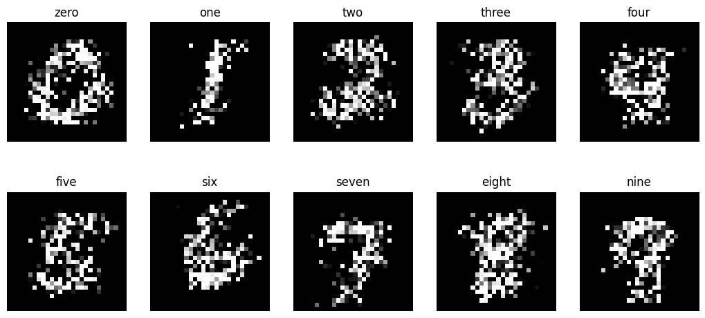

# BucketGen
BucketGen is a basic image generation algorithm that works by sampling from the pixel intensities in a dataset. 

## Basic Usage
BucketGen consists of two main components: the `DataLoader` and `Generator` classes. The `DataLoader` class converts a given directory of images to a NumPy array, and the `Generator` class creates images by sampling pixel values from a given NumPy array. 

The basic usage, including examples showing how to create images similar to the ones shown in the ["Example Outputs"](#Example-Outputs) section, is explained in the [demo jupyter notebook](demonstration.ipynb).

## Example Outputs
Examples of BucketGen output on some famous datasets:

**MNIST Handwritten Digits**

**CIFAR-10**

As expected, BucketGen performs terribly. Its output on the MNIST dataset is somewhat interpretable due to the fact that most digits in the dataset are in the same position and have roughly the same shape. However, because the CIFAR-10 dataset is significantly more complex than MNIST, it's output looks like random colors. 

## References
*This project uses the [CIFAR-10](https://www.cs.toronto.edu/~kriz/cifar.html) and [MNIST Handwritten Digits](http://yann.lecun.com/exdb/mnist/) datasets for testing.*
